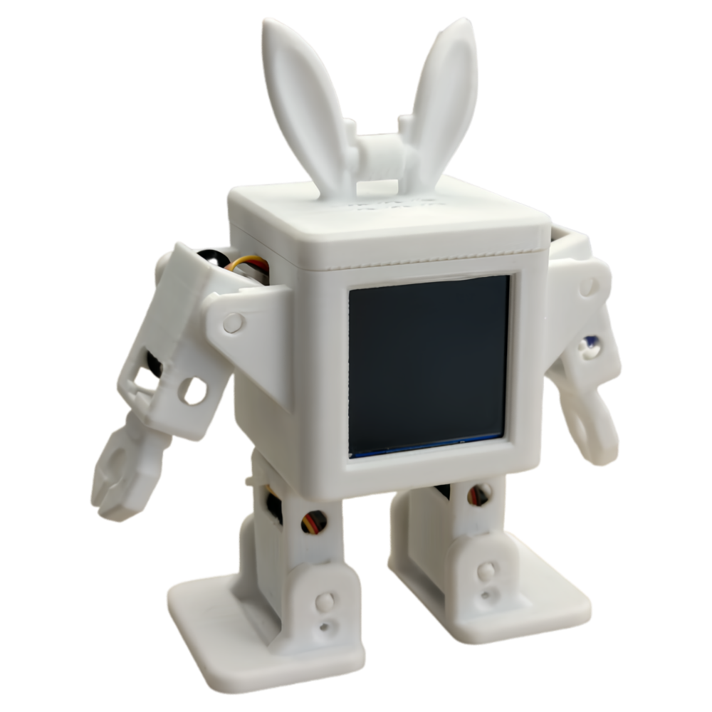
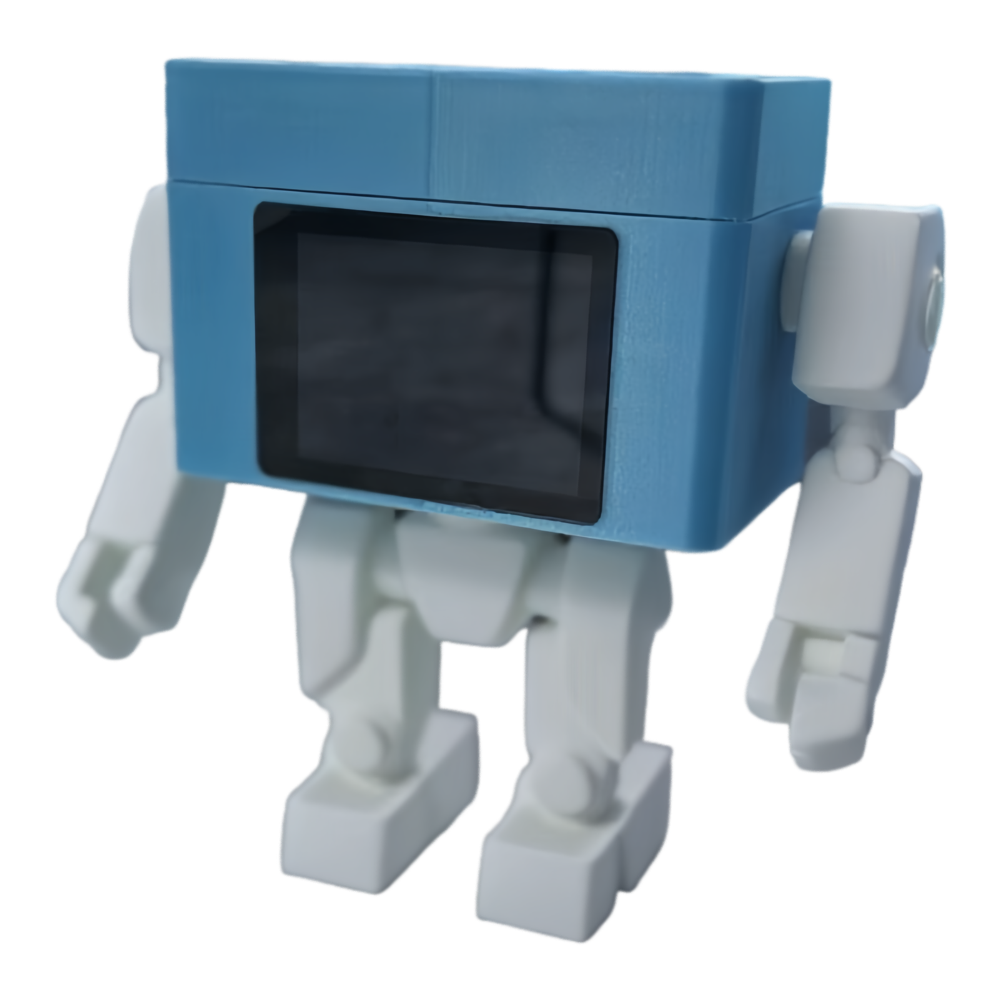
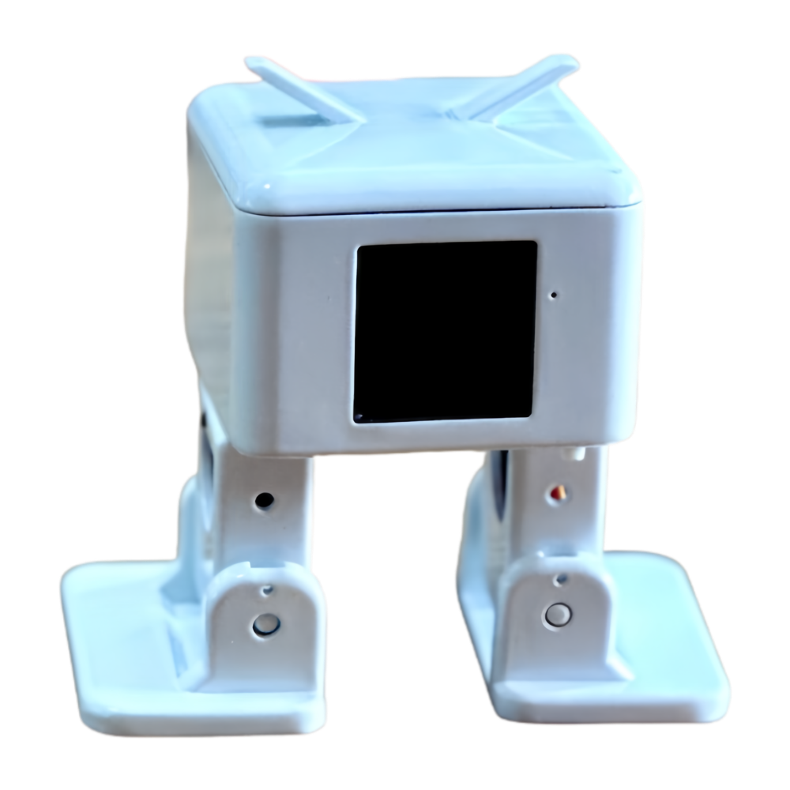
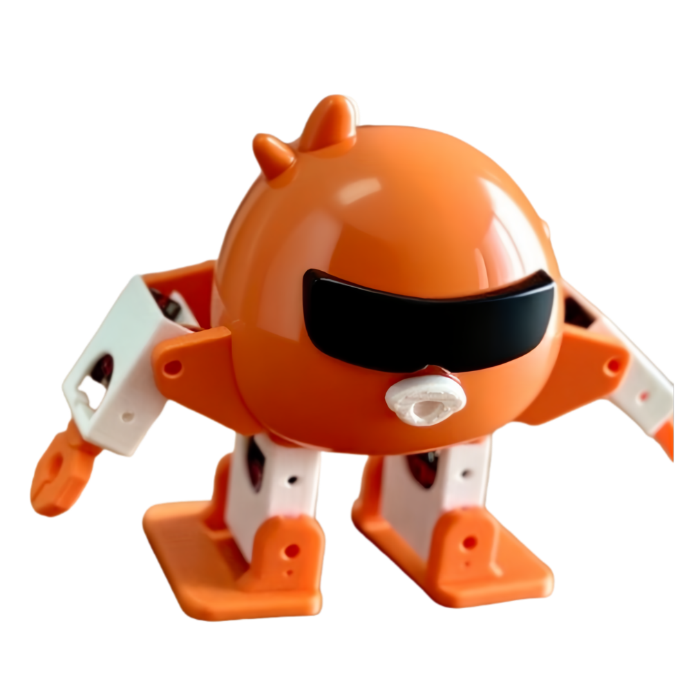
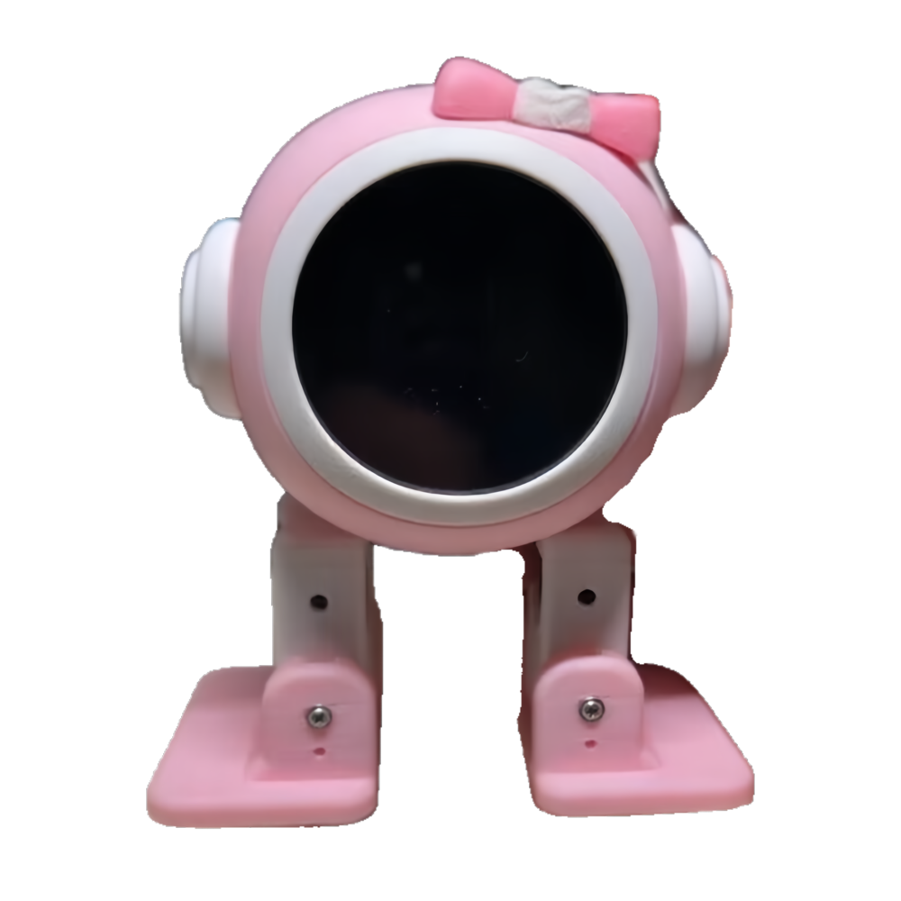
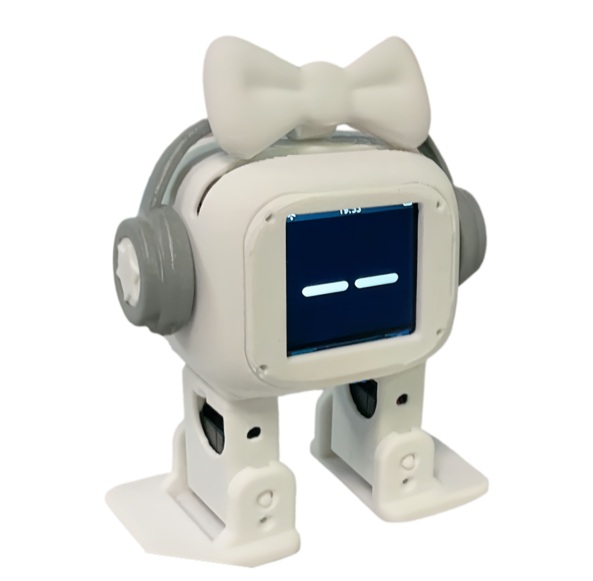
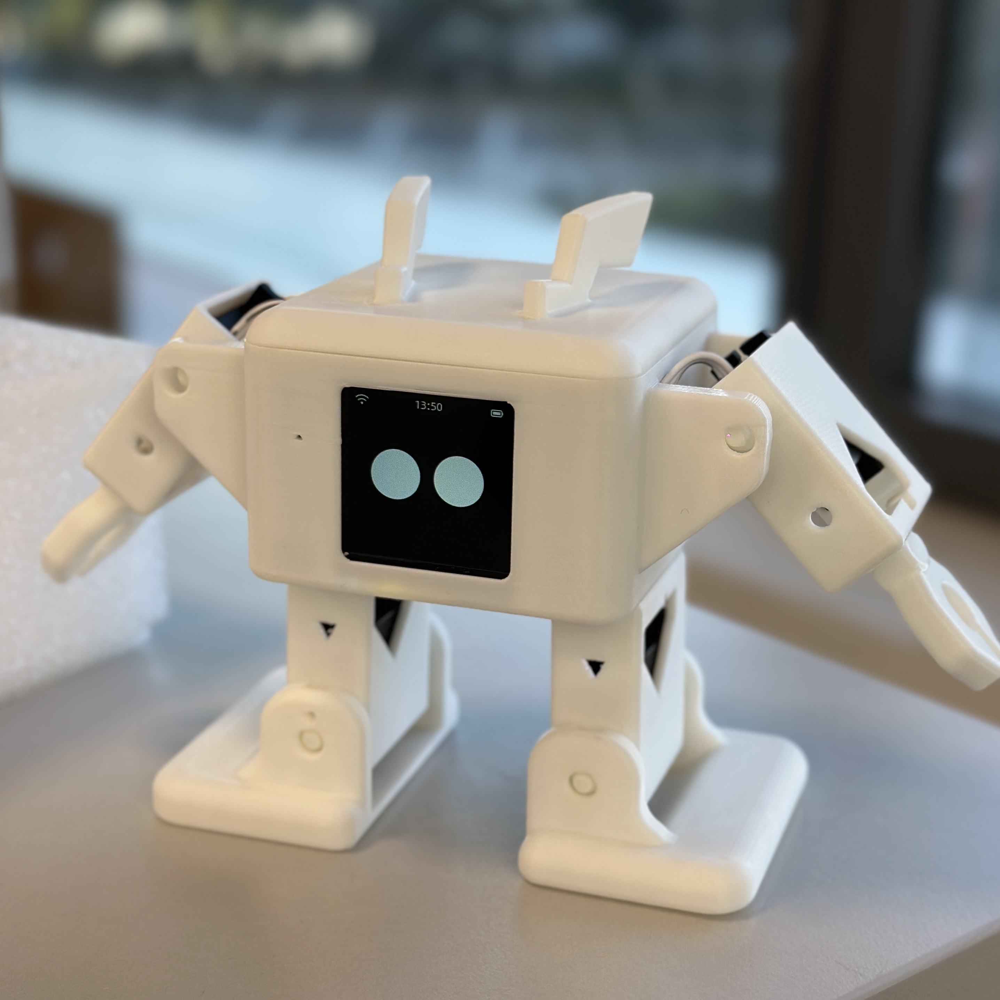
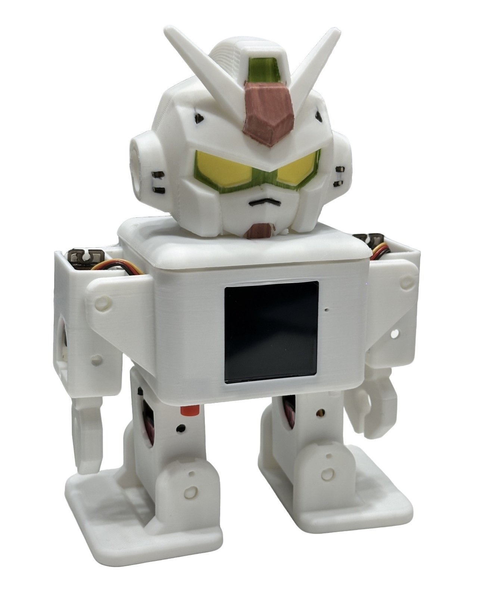
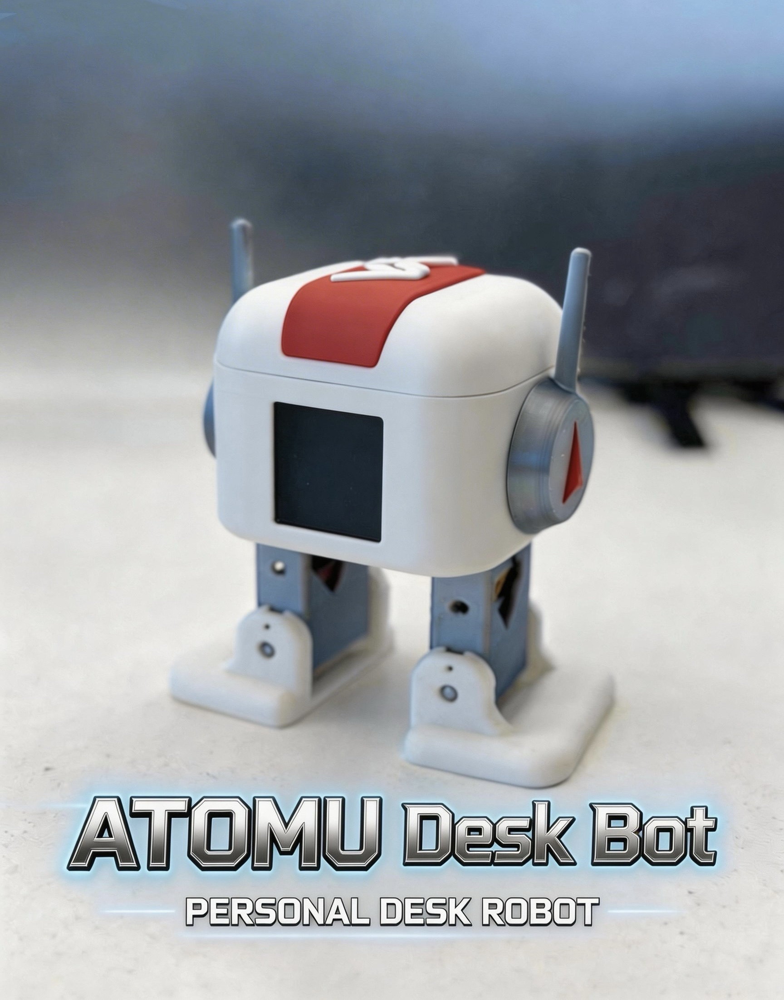

# OttoClaw — A desktop humanoid robot that never speaks out loud

[](LICENSE)
[](https://github.com/FlashCat-Jordan/OttoClaw)
[](https://github.com/FlashCat-Jordan/OttoClaw/releases)

**[中文](README.md) | [English](README_EN.md)**

<p align="center"></p>

OttoClaw is an AI desktop humanoid robot interaction system built on Shanmao Tech's open-source OttoRobot AI development board. Unlike other AI toys and desktop robots:

- **A truly local lightweight Agent** — Pure C / FreeRTOS, a single ESP32-S3 runs everything with no cloud dependency. Memory, sessions, and skills are all stored locally. 0.5W power, 24/7 always-on.
- **Never speaks out loud** — Unlike other robots that talk to you and interrupt your focus. Uses DingTalk messaging instead — when you're busy, it waits quietly; when you're free, a glance at messages triggers response. Always present, never intrusive.
- **Autonomous emotional expression** — 22 emotional states that fluctuate naturally with context — swaying when happy, covering face when shy, tilting head when thinking. Emotions are spontaneous, not passive.
- **Personality & Growth System** — It has its own personality. At first encounter, it may be aloof. As interactions accumulate, it gradually warms up and emotional bonds deepen organically. Your relationship may evolve into friendship, romance, rivalry, or even something like family — each bond has its own unique storyline, and its character is continuously shaped through your interactions. The red hearts (1-5) on the LCD's upper-right corner are a living witness to your growing bond.
- **AI truly controls every joint** — The LLM autonomously decides which angles each of the 6 servos should reach, creating any pose it can imagine — AI consciousness expressed physically, not preset scripts.
- **Fully open-source stack** — Hardware, software, and 3D models all open-source
- **Fully open architecture** — Choose your own model, interaction channel, MCP / Skill service integration. Bailian one-click connects to a rich ecosystem, with a growing open-source hacker community.
- **Functional module superset** — Microphone, display, speaker + amplifier, power management, capacitive touch, 6 servo channels, WiFi, Bluetooth all integrated on one board. Almost every AI toy and desktop robot's functional modules are subsets of this board — unlimited creative potential.
- **100+ community derivative works** — Makers have built 100+ derivative projects — 3D prints, firmware mods, appearance hacks. Technical support is always within reach.

Shanmao Tech 10K+ Geek Community: [Join Chat Group 4](https://qm.qq.com/q/Yn1lUxIwo2)


---

## Core Highlights

### Autonomous Emotional Expression — 22 Emotional States Fluctuate with Context

<p align="center"></p>

Existing robots have preset, passive emotions — they only smile when you press a button. OttoClaw's emotions are **AI-triggered autonomously**: during conversation, the LLM decides which emotion to express based on context, without user instruction.

- 22 emotional states: happy, shy, thinking, angry, surprised, bored, cyber, dizzy, excited...
- Swaying when happy, covering face when shy, tilting head when thinking
- Emotions are spontaneous, not passive — AI decides when and what to express
- LCD screen shows current emotional state in real time

### Personality & Growth System — From Aloof to Bonded, Relationships Evolve Organically

<p align="center"></p>

Aloof at first, warming as you chat. 5-stage relationship growth (Stranger → Acquainted → Familiar → Close → Bonded), AI autonomously deduces your relationship type. LCD red hearts (1~5) are a living witness to your growing bond.

### Truly Local Lightweight Agent — 0.5W Always-On

<p align="center"></p>

- USB powered, pure C / FreeRTOS, single ESP32-S3 runs everything
- No cloud dependency — memory, sessions, skills all stored locally
- 24/7 online at 0.5W, zero maintenance required
- No Linux, no Node.js, no bloated dependencies

### Designed for Introverts — Never Speaks Out Loud

<p align="center"></p>

Current companion robots universally adopt voice interaction — speaking, playing audio, interrupting focus.

**OttoClaw takes a fundamentally different approach:**

- **DingTalk messaging** — No voice, no interruption. When busy, it waits quietly; when available, a glance at messages triggers response. Always present, never intrusive.
- **Bidirectional interaction** — Send messages via DingTalk to trigger actions, get answers, or search information. All interaction stays in the message layer — quiet, private.
- **Captive Portal config** — Connect to hotspot and auto-redirect to config page, set up everything from your phone browser

> Full release includes an **extrovert edition** with voice conversation capability and proactive chat initiation.

### AI Servo Sequences — AI Autonomously Controls Every Joint

<p align="center"></p>

Existing robots rely on preset actions or voice-command mapping. OttoClaw grants AI the ability to **autonomously reason about motion**: the LLM interprets semantic intent and independently decides which angles each of the 6 servos should reach, creating any pose it can imagine.

```
User: "propose to me"
AI reasoning: proposal = kneel on one leg + raise right hand high + lower left hand + slight tilt
→ calls self.otto.pose: right_leg=30° right_foot=0° right_hand=10°(raised) left_hand=45°(lowered)
→ Robot executes: kneeling, hand raised
→ AI replies: "I kneel before you — will you marry me?"
```

The same "propose" request may yield different choreography each time. **This is AI truly controlling the body.**

> Lite edition provides AI Servo Sequences Lite. Full release integrates self-programming for richer AI-conscious physical expression.

### Fully Open-Source + Open Architecture — Choose Your Model, Channel & More

<p align="center"></p>

OttoClaw locks nothing down. All configuration is fully open:

- **2 LLM format types** — Anthropic-compatible + OpenAI-compatible, just provide your own Base URL to connect any model
- **DingTalk Stream mode** — Direct connection, no server needed
- **Alibaba Cloud Bailian one-click** — Search enhancement, Agent apps, MCP services, Skill packs
- **HTTP proxy support** — Clash/V2Ray/Shadowsocks compatible
- **Config portal + CLI dual entry** — Phone browser for setup, command line for maintenance
- **Hardware, software, and 3D models all open-source**

### Fully Open-Source Hardware — Functional Module Superset

OttoClaw supports two OttoRobot board variants:

| Board | Description | Firmware File |
|-------|------------|---------------|
| **OttoRobot AI (non-camera)** | The version most users have | `ottoclaw-full-v2.0-ai.bin` |
| **OttoCam519 (camera connector)** | Has an OV2640/OV3660 camera connector (camera not yet enabled) | `ottoclaw-full-v2.0-cam519.bin` |

Both boards share the same functional modules — microphone, display, speaker + amplifier, power management, capacitive touch, 6 servos, WiFi, Bluetooth. The camera board additionally has a camera connector, but uses a different GPIO layout, so it requires the matching firmware.

Hardware is also open-source, or purchase directly:

- **Official dev board — one-click purchase** — [Shanmao Robot Official Store](https://m.tb.cn/h.SRXKaIT7OtBRrpQ)
- **DIY kit (all components included, pre-flashed, 40 min assembly)** — [Shanmao Robot DIY Kit](https://e.tb.cn/h.SRfKOWrlDXV4kQR?tk=atRsf1poxdZ)
- **PCB + BOM open-source files** — Self-manufacturing also possible: [LCSC Open Hardware](https://oshwhub.com/txp666/ottorobot)
- **3D-printed shell STL files** — [MakerWorld @shanmaotech](https://makerworld.com.cn/@shanmaotech)
- **Complete assembly & usage guide** — [shanmaotech.cn/ottodiy](https://www.shanmaotech.cn/ottodiy/)
- **Community co-creation** — Makers have built stunning derivative works — 3D prints, firmware mods, appearance hacks, and more: [Achievement Wall](https://www.shanmaotech.cn/ottodiy/#showcase)

<table>
<tr><td></td><td></td><td></td><td></td></tr>
<tr><td></td><td></td><td></td><td></td></tr>
<tr><td></td><td></td><td></td><td></td></tr>
<tr><td></td><td></td><td></td><td></td></tr>
<tr><td></td><td></td><td></td><td></td></tr>
</table>

---

## Capabilities

### Improvised Action Composition (AI Servo Sequences Lite)

A single sentence, AI handles the entire process from semantic understanding to pose design:

```
"Give me a hug pose" → AI reasons pose → arms open + lean forward → "Come hug me!"
"Show anger" → AI reasons pose → feet planted + body forward → "I'm angry!"
"Bow" → AI reasons pose → upper body forward + hands low → "Respectfully bowing"
```

### Predefined Actions (22 Primitives)

| Category | Actions |
|----------|---------|
| Walking | walk / walk_backward / turn |
| Jumping | jump / updown |
| Grooving | swing / moonwalk |
| Poses | sit / bend / shake_leg / home |
| Hands | hands_up / hands_down / hand_wave |
| Flashy | windmill / takeoff / fitness |
| Emotions | greeting / shy |
| Routines | radio_calisthenics / magic_circle / showcase |

### Conversation, Search, and Memory

Interact via DingTalk — conversation, web search, and long-term memory:

```
"How's the weather in Hangzhou?" → [web_search] → "Sunny, 28°C, nice for a walk"
"Remember I love hotpot" → [memory_write] → "Recorded"
(Days later) → "Want a hotpot recommendation?" ← Remembers across reboots
```

---

## Interaction Channels

- **DingTalk** — Primary chat channel. Stream mode, no server needed. Quiet, designed for introverts.
- **WebSocket** — Port 18789. Built-in chat page, settings page, and WebSocket API for developer integration.
- **Serial CLI** — `oc>` prompt for local maintenance and configuration.

---

## Full Release Includes

The open-source Lite edition showcases core capabilities. The full release builds on this foundation:

- **AI Servo Sequences Full** — Self-programming integration. AI composes pose sequences and can program more complex continuous motion choreography, enabling richer AI-conscious physical expression.
- **Extrovert Edition** — Voice conversation capability, proactive chat initiation. Introvert edition stays quiet; extrovert edition is talkative and engaging.
- **Growth System** — At first encounter, it may be aloof. As interactions accumulate, it learns more about you and emotional bonds deepen. Your relationship may evolve toward friendship, romance, or even rivalry — each bond has its own unique storyline.
- **More Channels** — Feishu, WeCom, and additional social media integrations.
- **Deeper Bailian Integration** — Agent apps, MCP services, one-click configuration.

---

## Quick Start

### Prerequisites

1. Shanmao OttoRobot AI development board or DIY kit ([purchase links](#fully-open-source-hardware))
2. USB Type-C data cable (must support data transfer, not just charging)
3. LLM API Key (see config steps below)
4. DingTalk account
5. Alibaba Cloud account (optional, for Bailian search)

### Step 1: Download the correct firmware

> **Important:** Download the firmware matching your board. The two boards have different GPIO layouts — using the wrong firmware will result in a blank screen and non-functional servos!

| Board | Firmware File | How to identify |
|-------|--------------|----------------|
| OttoRobot AI (non-camera) | `ottoclaw-full-v2.0-ai.bin` | No camera connector on board |
| OttoCam519 (camera connector) | `ottoclaw-full-v2.0-cam519.bin` | Camera ribbon connector on board |

Download from [Releases](https://github.com/FlashCat-Jordan/OttoClaw/releases).

### Step 2: Flash Firmware

Three methods — pick one:

**Method A: Online one-click flash (easiest, recommended for beginners)**

1. Download the firmware matching your board
2. Connect the board via USB, keep it powered on
3. Open [16302.com/localinit](https://www.16302.com/localinit), select chip type **ESP series > any**, upload the bin file (write address 0x0, no need to change)
4. Click "Start Flash" and wait for completion
5. Press EN to reboot

**Method B: esptool command-line flash**

1. Download the firmware matching your board
2. Install esptool: `pip install esptool`
3. Connect the board via USB, hold BOOT then press EN to enter download mode
4. Flash:
```bash
# Non-camera board
esptool.py --chip esp32s3 --port PORT --baud 460800 --before default_reset --after hard_reset write_flash -z 0x0 ottoclaw-full-v2.0-ai.bin

# Camera board
esptool.py --chip esp32s3 --port PORT --baud 460800 --before default_reset --after hard_reset write_flash -z 0x0 ottoclaw-full-v2.0-cam519.bin
```
PORT: `/dev/cu.usbmodem1101` (Mac) or `COM3` (Windows)

5. Press EN to reboot

**Method C: Compile source code then flash (for developers)**

1. Install ESP-IDF build tools:
```bash
# Mac / Linux
git clone -b v5.5.2 --depth 1 https://github.com/espressif/esp-idf.git ~/esp/esp-idf
cd ~/esp/esp-idf && ./install.sh esp32s3
source ~/esp/esp-idf/export.sh   # Execute before each build session
```
Windows: [ESP-IDF Windows Setup Guide](https://docs.espressif.com/projects/esp-idf/en/v5.5.2/esp32s3/get-started/windows-setup.html)

2. Get the code:
```bash
git clone https://github.com/FlashCat-Jordan/OttoClaw.git
cd OttoClaw
cp main/ottoclaw_secrets.h.example main/ottoclaw_secrets.h
```

3. Build & flash:
```bash
idf.py set-target esp32s3
idf.py build
idf.py -p PORT flash
```

> **Board selection:** Non-camera board (default) compiles directly. Camera board (OttoCam519) users need to run `idf.py menuconfig` first, go to "OttoClaw Board" → select "OttoCam519 (camera)", then build & flash.

### Step 3: Enter Config Portal

After flashing, the device enters config portal mode automatically because no WiFi is configured. You can also re-enter config portal anytime:

- **Short press BOOT button** — Press BOOT once while running to re-enter config portal
- **Auto-trigger on failure** — When WiFi password is wrong or API key is invalid, the device automatically enters config mode and shows the specific error on the LCD screen (e.g. "WiFi password wrong", "API key invalid")

#### Connect to Config Portal

1. Open phone WiFi settings, find hotspot `OttoClaw-XXXX` (no password), connect
2. After connecting, the browser **auto-redirects** to the config page (Captive Portal). If it doesn't auto-redirect, manually open http://192.168.4.1
3. Page shows 5 tabs at top: **WiFi**, **LLM**, **DingTalk**, **Other**, **Otto Test**

### Step 4: Configure WiFi

1. Click **WiFi** tab at top
2. Click **Scan Nearby** button, wait a few seconds for nearby WiFi list to appear
3. Click your WiFi name in the list (auto-fills SSID field), or type it manually
4. Type your WiFi password
5. Click **Save WiFi** button

### Step 5: Configure LLM (Required)

OttoClaw supports two LLM API format types. Just pick a format and provide your own API Key and Base URL:

| Format | Use case | Auto-appended path | Auth method |
|--------|----------|-------------------|-------------|
| **Anthropic-compatible** | Claude, DashScope Anthropic endpoint, etc. | `/v1/messages` | x-api-key |
| **OpenAI-compatible** | Qwen, DeepSeek, OpenAI, Gemini, Groq, Zhipu, etc. | `/chat/completions` | Bearer Token |

You only need to input the **Base URL** (base path), and the system auto-appends the correct API path. Examples:

- OpenAI-compatible + Qwen: Base URL = `https://dashscope.aliyuncs.com/compatible-mode/v1` → system appends `/chat/completions`
- Anthropic-compatible + DashScope Anthropic: Base URL = `https://dashscope.aliyuncs.com/apps/anthropic` → system appends `/v1/messages`
- OpenAI-compatible + DeepSeek: Base URL = `https://api.deepseek.com/v1` → system appends `/chat/completions`
- Anthropic-compatible + Anthropic official: Base URL = `https://api.anthropic.com` → system appends `/v1/messages`

> Leave Base URL empty to use defaults (Anthropic-compatible: `https://api.anthropic.com`, OpenAI-compatible: `https://api.openai.com/v1`)

**Configuration steps:**

1. On config portal, click **LLM** tab
2. "Provider" dropdown: select **Anthropic-compatible** or **OpenAI-compatible**
3. "API Key": paste your key from the LLM platform
4. "Model Name": type the model name (e.g. `qwen-max`, `deepseek-chat`, `claude-sonnet-4-5`)
5. "Base URL": type the base path for your platform (see examples above)
6. Click **Save** button

**Getting API Keys:**

- **Qwen (recommended for China, no proxy needed)**: Open [DashScope Console](https://dashscope.console.aliyun.com/) → enable service → API Key Management → Create API Key → select OpenAI-compatible format → Base URL = `https://dashscope.aliyuncs.com/compatible-mode/v1`
- **DeepSeek (China direct, high value)**: Open [DeepSeek Platform](https://platform.deepseek.com/) → API Keys → Create → select OpenAI-compatible format → Base URL = `https://api.deepseek.com/v1`
- **Anthropic Claude (proxy required in China)**: Open [Anthropic Console](https://console.anthropic.com/) → Create API Key → select Anthropic-compatible format → Base URL = `https://api.anthropic.com` → also configure HTTP proxy in **Other** tab

### Step 6: Configure DingTalk (Required)

DingTalk is OttoClaw's primary interaction channel. Without DingTalk, you cannot chat with the robot.

#### Create a DingTalk Bot

1. On computer, open [DingTalk Developer Platform](https://open-dev.dingtalk.com/) and log in
2. Click "App Development" → "Create App"
3. **Select "Robot" as the app type** (do not select other types)
4. Fill in app name (e.g. "OttoClaw") and description → click Create
5. After creation, enter app details → in left sidebar "Credentials & Basic Info" → copy **App Key** and **App Secret**
6. **Critical step — Enable message receiving permissions:**
   - In left sidebar find "Event Subscription" or "Message Receiving"
   - **Message receiving mode must be "Stream mode"** (do NOT select HTTP callback — OttoClaw cannot receive messages via HTTP callback)
   - Confirm the following permissions are enabled:
     - `chatbot.message.read` — Robot reads messages
     - `chatbot.message.send` — Robot sends messages
     - `im.message.send` — Send single-chat messages
   - If there's an "Apply for Permissions" button, apply for all related permissions
7. Publish the bot: click "Version Management & Publish" → "Publish" → select scope (recommend testing with yourself first)

#### Enter DingTalk credentials in config portal

1. On phone config portal, click **DingTalk** tab
2. "App Key": paste the App Key you copied
3. "App Secret": paste the App Secret
4. Click **Save** button

> After configuration, find your bot in DingTalk and send a message to test if it responds correctly.

### Step 7: Configure Search & Bailian (Optional)

To enable web search:

1. On computer, open [Bailian Platform](https://bailian.console.aliyun.com/) → log in
2. Click "Create App" → edit app → configure web search feature → publish app
3. Copy **App ID** (format: `758d9af4xxxx`)
4. In "API Key Management" → create or copy API Key (shared with DashScope)
5. On phone config portal, click **Other** tab
6. "Search API Key": type your DashScope API Key
7. "Bailian Search App ID": paste the App ID
8. Click **Save Search Config**

### Step 8: Configure HTTP Proxy (Optional)

Users in China accessing Anthropic Claude and other overseas APIs may need a proxy:

1. On config portal, click **Other** tab
2. "Proxy Host": type proxy server IP (e.g. `192.168.1.83`)
3. "Proxy Port": type proxy port (e.g. `7897`, your Clash/V2Ray HTTP port)
4. Click **Save Proxy**

### Step 9: Save & Reboot

After all configs are done, click **Save & Reboot** button at the page bottom. This button saves ALL tab configs first, then triggers reboot — no need to save each tab individually.

> **Test motions:** Before rebooting, visit **Otto Test** tab to click action buttons and verify servos work correctly.

After reboot, the device auto-connects WiFi, LLM, and DingTalk. The LCD upper-right corner shows a red heart (1 heart = Stranger stage), indicating the relationship growth system is active.

#### Re-entering Config Portal

- **Short press BOOT button** to re-enter config portal anytime
- WiFi or LLM connection failure auto-triggers config mode, LCD shows the specific error reason
- The config portal displays **all saved values in plaintext** (including passwords and keys), making it easy to verify and modify
- Only fix the field that's wrong — other fields preserve their saved values

---

## CLI Commands (Advanced Users)

Config portal handles all everyday settings. Below CLI commands are for advanced debugging via USB serial (115200 baud):

```
oc> wifi_set <ssid> <pass>        Set WiFi
oc> set_dingtalk <key> <secret>   Set DingTalk credentials
oc> set_api_key <key>             Set LLM API key
oc> set_model <model>             Set model name
oc> set_model_provider <provider> Set provider (anthropic / openai_compat)
oc> set_base_url <url>            Set Base URL
oc> set_search_key <key>          Set search API key
oc> set_bailian_app_id <id>       Set Bailian App ID
oc> set_proxy <host> <port>       Set HTTP proxy
oc> clear_proxy                   Remove proxy
oc> config_show                   Display current config
oc> config_reset                  Clear runtime config
oc> restart                       Restart device
oc> wifi_status                   Show WiFi status & IP
oc> wifi_scan                     Scan nearby WiFi
oc> memory_read                   Display long-term memory
oc> memory_write "content"        Write to long-term memory
oc> heap_info                     Show available heap
oc> session_list                  List chat sessions
```

---

## Memory System

All data stored as plain text on SPIFFS, readable and writable by AI:

| File | Description |
|------|-------------|
| `SOUL.md` | Robot personality and character |
| `USER.md` | User preference profile |
| `MEMORY.md` | Long-term memory (cross-session) |
| `RELATION.md` | Relationship growth data (stage, message count, relationship type) |
| `YYYY-MM-DD.md` | Daily notes (auto-generated) |
| `<chat_id>.jsonl` | Chat history (per-conversation archive) |

---

## Technical Architecture

- **Pure C / FreeRTOS** — Single ESP32-S3 runs everything
- **Dual-core** — Core 0 handles network I/O; Core 1 runs Agent loop
- **Anthropic tool use / ReAct loop** — AI autonomously decides tool calls and composition
- **6 servo LEDC PWM** — Independent joint control, oscillator-driven smooth motion
- **SPIFFS local storage** — Memory, sessions, config, skills — all on-device, cloud-independent

Full details: **[docs/ARCHITECTURE.md](docs/ARCHITECTURE.md)** and **[docs/TODO.md](docs/TODO.md)**

---

## License

CC BY-NC-SA 4.0 — Attribution, NonCommercial, ShareAlike. Free for personal learning and research; commercial use requires separate authorization.

---

## Acknowledgments

Inspired by [OpenClaw](https://github.com/openclaw/openclaw), [Nanobot](https://github.com/HKUDS/nanobot), [mimiclaw](https://github.com/memovai/mimiclaw), and [OttoDIYLib](https://github.com/OttoDIY/OttoDIYLib). We brought the AI Agent architecture to embedded hardware and gave it a more embodied, playful device experience.

---

## Star History

[](https://star-history.com/#FlashCat-Jordan/OttoClaw&Date)